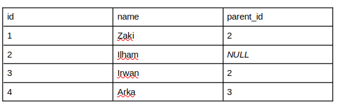
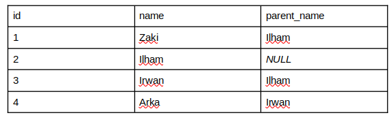

## Pre Assessment Software Engineer - Back End Ultra Voucher

Selamat datang di repositori ini! Berikut adalah penyelesaian dari dua problem yang diberikan sebagai bagian dari Pre Assessment Software Engineer - Back End.

### Deskripsi tugas
1. Logic Test
    
    Mengelompokkan array of strings menjadi kumpulan anagram.
2. Query Test

    Membuat query SQL untuk menggabungkan tabel dengan self-join sehingga menghasilkan kolom parent name.


### Penyelesaian
1. Logic Test

    ## Problem:
    Diberikan Array:

    ```javascript
    ['cook', 'save', 'taste', 'aves', 'vase', 'state', 'map']
    ```
    Hasil yang diharapkan:
    ```javascript
    [
        ['cook'],
        ['save', 'aves', 'vase'],
        ['taste', 'state'],
        ['map']
    ]
    ```
2. Query test
    ### Problem
    diberikan tabel:

    

    Hasil yang diharapkan:
    

    ### Jawaban

    ```SQL
    SELECT
        child.id,
        child.name,
        parent.name AS parent_name
    FROM
        testing AS child
            LEFT JOIN
        testing AS parent
    ON
        child.parent_id = parent.id;
    ```


    


